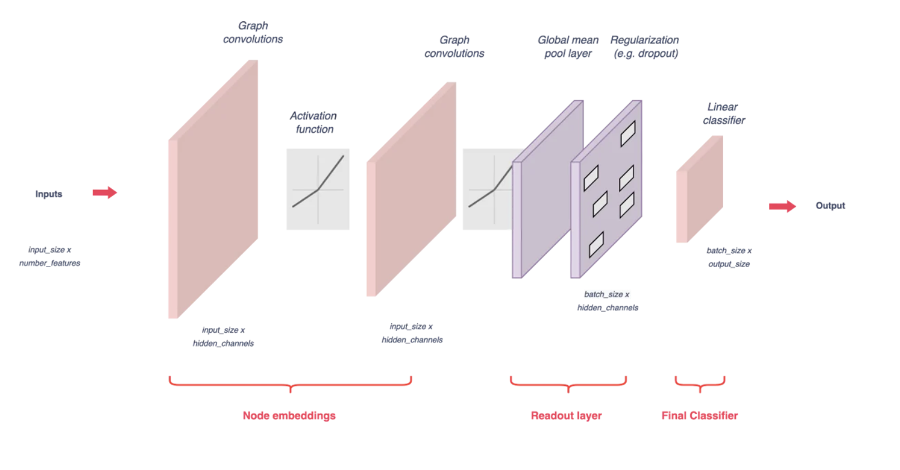

# Installation Guide

## Setting Up the Environment
To set up your project environment, follow these steps:

``` bash 
    $ cd <project-directory> 

    $ pipenv shell 

    $ pip install -r requirements.txt 
   ```

## Download pretrained word embeddings ##

**Download the itwiki_20180420_100d file in TXT format from the following link and place it in the wikipedia2vec
folder: [Pretrained Wikipedia2Vec Embeddings](https://wikipedia2vec.github.io/wikipedia2vec/pretrained/)**

## Datasets ##

**The network can be trained using any dataset in CSV format. Ensure that the dataset contains two columns named "Text"
and "Label".**

## Architecture ##



## References

- Yao, L., Mao, C., & Luo, Y. (2018). Graph Convolutional Networks for Text Classification. *arXiv preprint arXiv:1809.05679v3 [cs.CL]*. Available at: [https://doi.org/10.48550/arXiv.1809.05679](https://doi.org/10.48550/arXiv.1809.05679)

